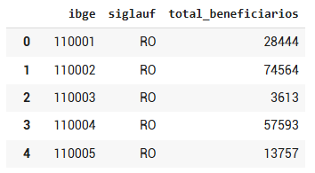
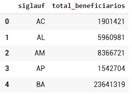
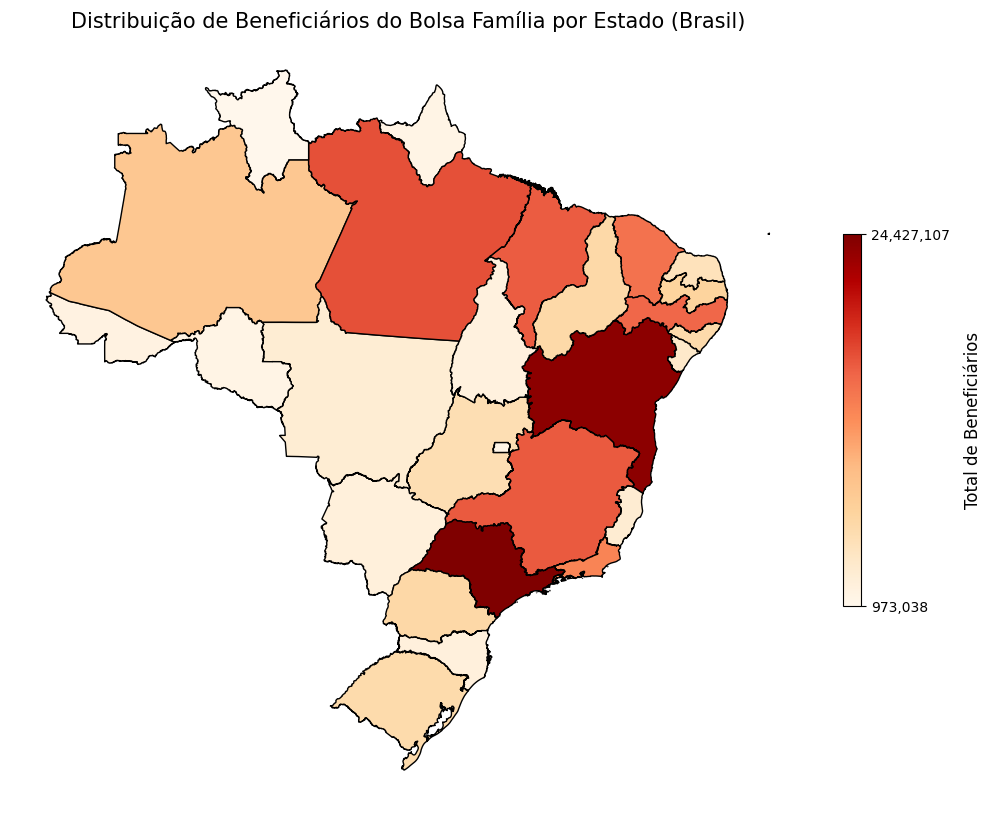
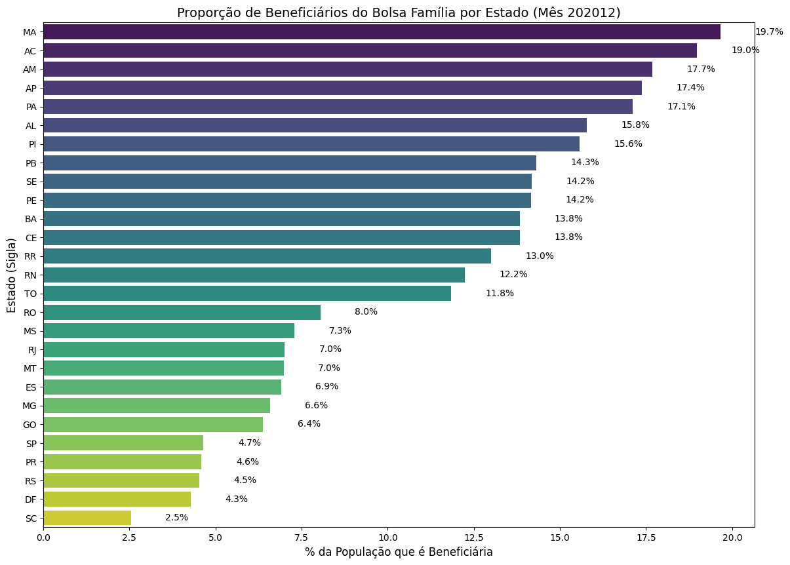
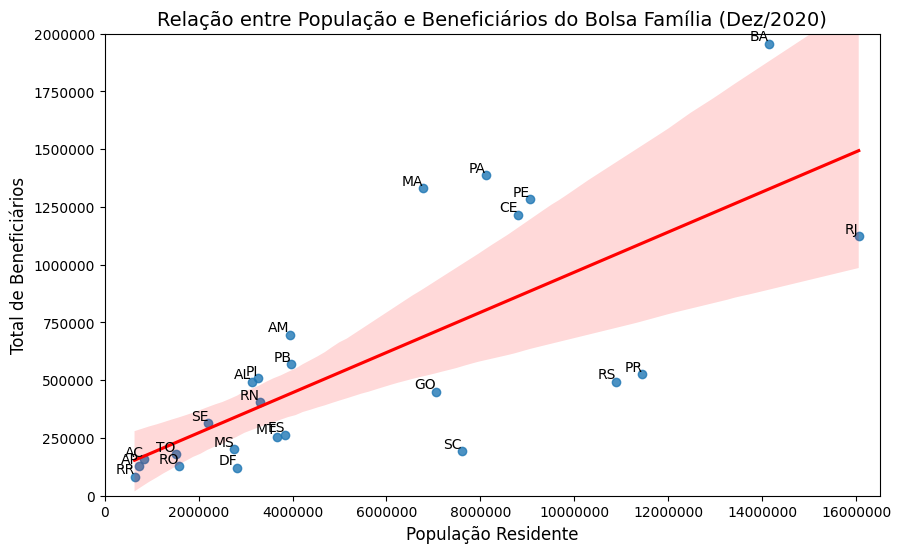
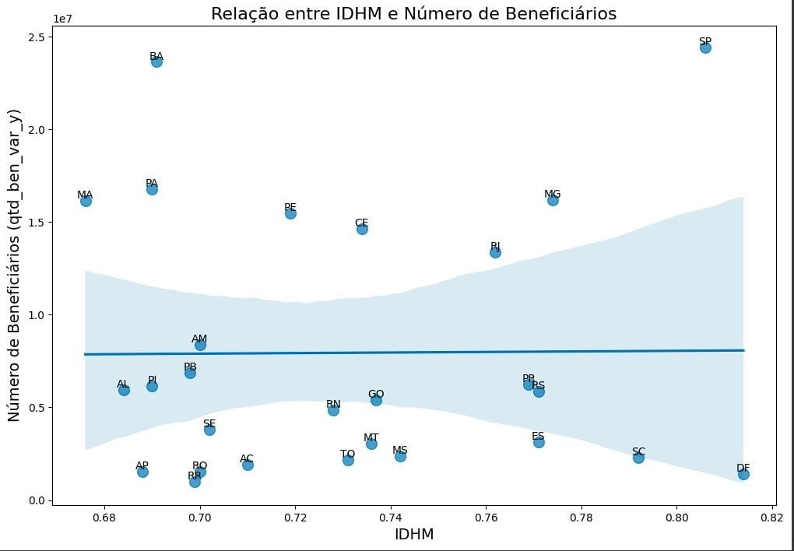

# Análise de dados do Bolsa Família

### :teacher: Prof. Gustavo Fontoura de Souza
#### :busts_in_silhouette: Guilherme Aurélio, Emilly Jenniffer e Rickson Rocha
#### :book: Técnicas de Análise de Dados
:pencil2: Curso de Sistemas para Internet

---

# Base de dados

---

# Distribuição de beneficiários do Bolsa Família por município e estado 

  
  

---
## Mapa de Beneficiários do Bolsa Família por Estado

  

---
### Proporção de Beneficiários em relação à População por Estado (mês 202012)

  

---
## Regressão Linear entre População e Beneficiários do Bolsa Família

  

---
## Regressão Linear entre IDHM e Beneficiários do Bolsa Família

  

---
# Obrigado! 

📧 guilherme.aurelio@escolar.ifrn.edu.br
📧 emilly.jenniffer@escolar.ifrn.edu.br
📧 rickson.rocha@escolar.ifrn.edu.br 
